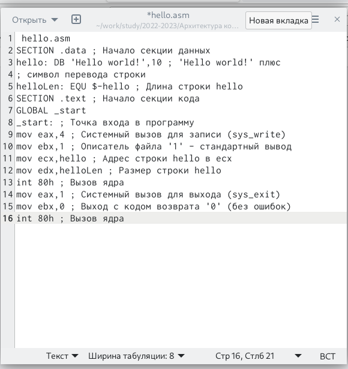
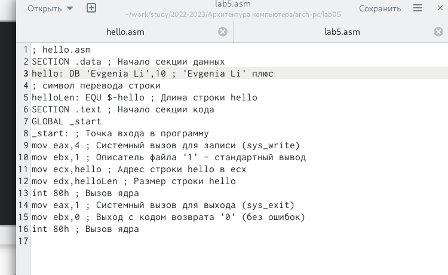

---
## Front matter
title: "Лабораторная работа No5. Создание и процесс обработки программ на языке ассемблера NASM"

subtitle: "Дисциплина: Архитектура компьютера"

author: "Ли Евгения Олеговна"

## Generic otions
lang: ru-RU
toc-title: "Содержание"

## Bibliography
bibliography: bib/cite.bib
csl: pandoc/csl/gost-r-7-0-5-2008-numeric.csl

## Pdf output format
toc: true # Table of contents
toc-depth: 2
lof: true # List of figures
lot: true # List of tables
fontsize: 12pt
linestretch: 1.5
papersize: a4
documentclass: scrreprt
## I18n polyglossia
polyglossia-lang:
  name: russian
  options:
	- spelling=modern
	- babelshorthands=true
polyglossia-otherlangs:
  name: english
## I18n babel
babel-lang: russian
babel-otherlangs: english
## Fonts
mainfont: PT Serif
romanfont: PT Serif
sansfont: PT Sans
monofont: PT Mono
mainfontoptions: Ligatures=TeX
romanfontoptions: Ligatures=TeX
sansfontoptions: Ligatures=TeX,Scale=MatchLowercase
monofontoptions: Scale=MatchLowercase,Scale=0.9
## Biblatex
biblatex: true
biblio-style: "gost-numeric"
biblatexoptions:
  - parentracker=true
  - backend=biber
  - hyperref=auto
  - language=auto
  - autolang=other*
  - citestyle=gost-numeric
## Pandoc-crossref LaTeX customization
figureTitle: "Рис."
tableTitle: "Таблица"
listingTitle: "Листинг"
lofTitle: "Список иллюстраций"
lotTitle: "Список таблиц"
lolTitle: "Листинги"
## Misc options
indent: true
header-includes:
  - \usepackage{indentfirst}
  - \usepackage{float} # keep figures where there are in the text
  - \floatplacement{figure}{H} # keep figures where there are in the text
---

# Цель работы

Освоение процедуры компиляции и сборки программ, написанных на ассемблере NASM.

# Задание

Освоить процедуры компиляции и сборки программ, которые написаны на ассемблере NASM.

# Теоретическое введение

Основные функциональные элементы любой электронно-вычислительной машины (ЭВМ):

центральный процессор, память и периферийные устройства.

Оперативное запоминающее устройство (ОЗУ) — это быстродействующее энергозависимое запоминающее устройство, которое напрямую взаимодействует с узлами процессора, предназначенное для хранения

программ и данных, с которыми процессор непосредственно работает в текущий момент. Состоит из одинаковых пронумерованных ячеек памяти. Номер ячейки памяти — это адрес хранящихся в ней данных.

# Выполнение лабораторной работы

5.3.1. Программа Hello world!

Я создала каталог для работы с программами на языке ассемблера NASM (рис. [-@fig:001])

{ #fig:001 width=70% }

Перешла в созданный каталог и создала текстовый файл с именем hello.asm и открыла этот файл с помощью текстового редактора gedit и ввела в него требуемый текст: (рис. [-@fig:002; -@fig:003])

{ #fig:002 width=70%}

{ #fig:003 width=70%}

5.3.2. Транслятор NASM (рис. [-@fig:004])

Я скомпилировала текст программы «Hello World» и с помощью команды ls проверила, что объектный файл был создан. 

{ #fig:004 width=70%}

5.3.3. Расширенный синтаксис командной строки NASM (рис. [-@fig:005])

{ #fig:005 width=70% }
 

5.4. Компоновщик LD(рис. [-@fig:006; -@fig:007])

{ #fig:006 width=70% }

{ #fig:007 width=70% }

5.4.1. Запуск исполняемого файла (рис. [-@fig:008])

{ #fig:008 width=70% }

5.5. Задание для самостоятельной работы

1. С помощью команды cp создала копию файла hello.asm с именем lab5.asm (рис. [-@fig:009])

{ #fig:009 width=70% }

2. Внесла изменения в текст программы в файле lab5.asm так, чтобы вместо Hello world! на экран выводилось Evgenia Li (рис. [-@fig:010; -@fig:011])

{ #fig:010 width=70% }

{ #fig:011 width=70% }

3. Оттранслировала полученный текст программы lab5.asm в объектный файл. Выполнила компоновку объектного файла и запустила получившийся исполняемый файл. (рис. [-@fig:012; -@fig:013; -@fig:014; -@fig:015])

{ #fig:012 width=70% }

{ #fig:013 width=70% }

{ #fig:014 width=70% }

{ #fig:015 width=70% }

4. Скопировала файлы hello.asm и lab5.asm в локальный репозиторий в каталог ~/work/study/2022-2023/"Архитектура компьютера"/arch-pc/labs/lab05/. Загрузила файлы на Github (рис. [-@fig:016; -@fig:017)

{ #fig:016 width=70% }

{ #fig:017 width=70% }

# Выводы

Я освоила процедуры компиляции и сборки программ, написанных на ассемблере NASM.

# Список литературы{.unnumbered}

::: {#refs}
:::
