---
## Front matter
title: "Лабораторная работа №6"
subtitle: "Дисциплина: Архитектура компьютера"
author: "Ли Евгения Олеговна"

## Generic otions
lang: ru-RU
toc-title: "Содержание"

## Bibliography
bibliography: bib/cite.bib
csl: pandoc/csl/gost-r-7-0-5-2008-numeric.csl

## Pdf output format
toc: true # Table of contents
toc-depth: 2
lof: true # List of figures
lot: true # List of tables
fontsize: 12pt
linestretch: 1.5
papersize: a4
documentclass: scrreprt
## I18n polyglossia
polyglossia-lang:
  name: russian
  options:
	- spelling=modern
	- babelshorthands=true
polyglossia-otherlangs:
  name: english
## I18n babel
babel-lang: russian
babel-otherlangs: english
## Fonts
mainfont: PT Serif
romanfont: PT Serif
sansfont: PT Sans
monofont: PT Mono
mainfontoptions: Ligatures=TeX
romanfontoptions: Ligatures=TeX
sansfontoptions: Ligatures=TeX,Scale=MatchLowercase
monofontoptions: Scale=MatchLowercase,Scale=0.9
## Biblatex
biblatex: true
biblio-style: "gost-numeric"
biblatexoptions:
  - parentracker=true
  - backend=biber
  - hyperref=auto
  - language=auto
  - autolang=other*
  - citestyle=gost-numeric
## Pandoc-crossref LaTeX customization
figureTitle: "Рис."
tableTitle: "Таблица"
listingTitle: "Листинг"
lofTitle: "Список иллюстраций"
lotTitle: "Список таблиц"
lolTitle: "Листинги"
## Misc options
indent: true
header-includes:
  - \usepackage{indentfirst}
  - \usepackage{float} # keep figures where there are in the text
  - \floatplacement{figure}{H} # keep figures where there are in the text
---

# Цель работы

Приобретение практических навыков работы в Midnight Commander. Освоение инструкций языка ассемблера mov и int.

# Задание

Приобрести практические навыки работы в Midnight Commander. Освоить инструкции языка ассемблера mov и int.

# Теоретическое введение

Midnight Commander (или просто mc) — это программа, которая позволяет просматривать структуру каталогов и выполнять основные операции по управлению файловой системой, т.е. mc - файловый менеджер.

Программа на языке ассемблера NASM состоит из трёх секций:

секция кода программы (SECTION .text), секция инициированных (известных во время компиляции) данных (SECTION .data) и секция неинициализированных данных (тех, под которые во время компиляции только отводится

память,а значение присваивается в ходе выполнения программы) (SECTION .bss).

# Выполнение лабораторной работы

1. Открыла Midnight Commander(рис. [-@fig:001])

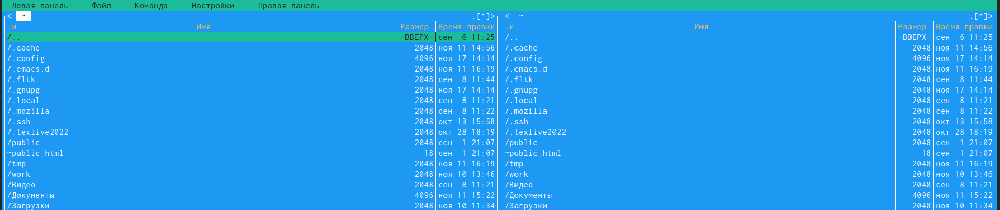{ #fig:001 width=70% }

2. Пользуясь клавишами перешла в каталог ~/work/arch-pc созданный при выполнении лабораторной работы No5  (рис. [-@fig:002])

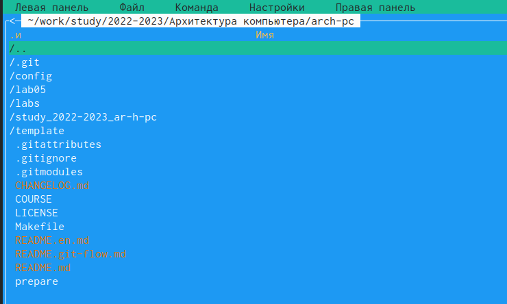{ #fig:002 width=70% }

3. С помощью функциональной клавиши F7 создала папку lab06 и перешла в созданный каталог. (рис. [-@fig:003])

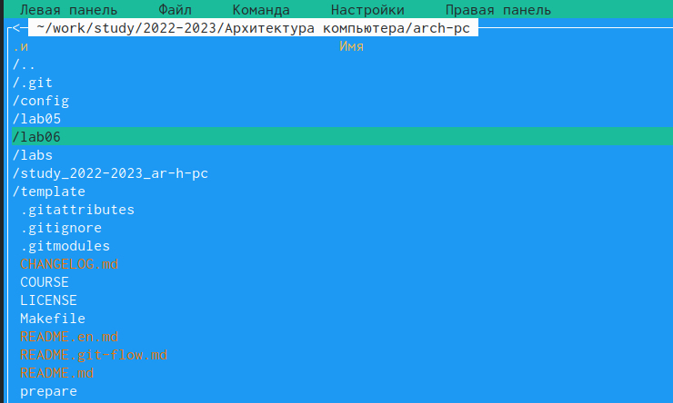{ #fig:003 width=70% }

4. Пользуясь строкой ввода и командой touch создала файл lab6-1.asm (рис. [-@fig:004])

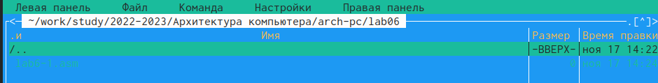{ #fig:004 width=70% }

5. С помощью функциональной клавиши F4 открыла файл lab6-1.asm для редактирования во встроенном редакторе. (рис. [-@fig:005])

{ #fig:005 width=70% }

6. Ввела текст программы из листинга 6.1 , сохранила изменения и закрыла файл.(рис. [-@fig:006])

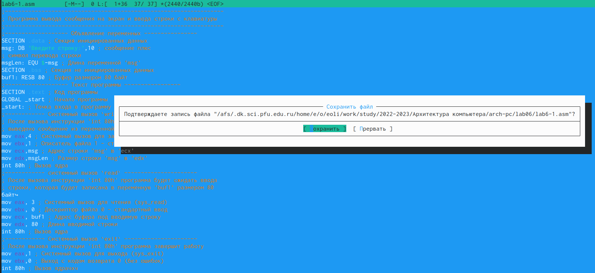{ #fig:006 width=70% }

7. С помощью функциональной клавиши F3 открыла файл lab6-1.asm для просмотра. Убедилась, что файл содержит текст программы.(рис. [-@fig:007])

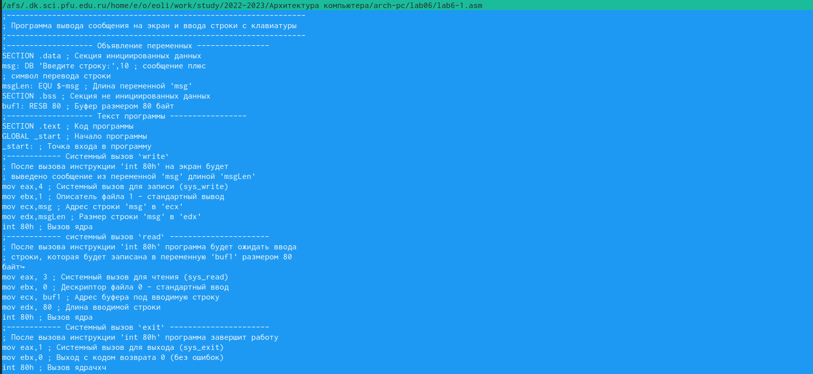{ #fig:007 width=70% }

8. Оттранслировала текст программы lab6-1.asm в объектный файл. Выполнила компоновку объектного файла и запустила получившийся исполняемый файл. На запрос'Введите строку:'ввела ФИО. (рис. [-@fig:008])

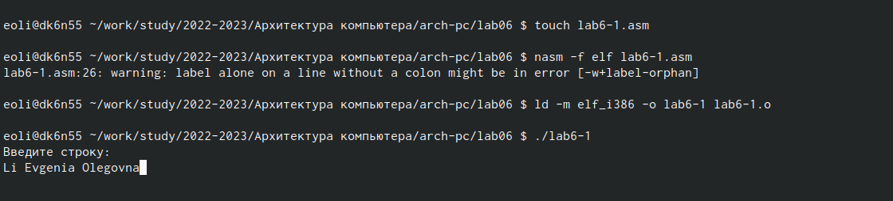{ #fig:008 width=70% }

6.3.1. Подключение внешнего файла in_out.asm

9. Скачаkf файл in_out.asm со страницы курса в ТУИС.(рис. [-@fig:009])

{ #fig:009 width=70% }

10. Подключаемый файл in_out.asm переместила в каталог, что и файл с программой, в которой он используется (рис. [-@fig:010])

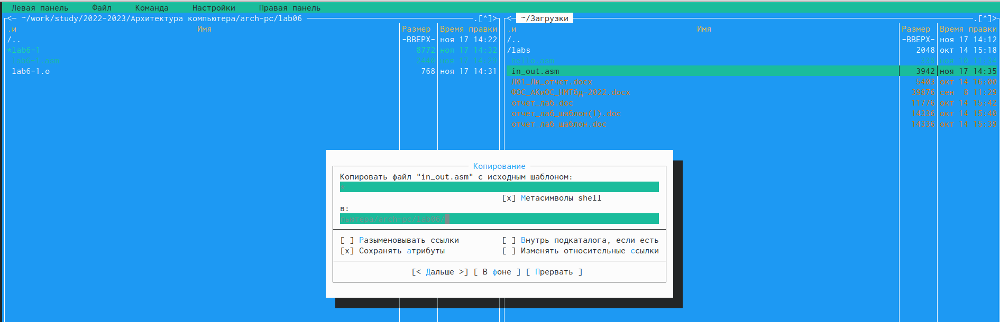{ #fig:010 width=70% }

11. С помощью функциональной клавиши F6 создала копию файла lab6-1.asm с именем lab6-2.asm. Выделила файл lab6-1.asm, нажала клавишу F6 , ввела имя файла lab6-2.asm (рис. [-@fig:011])

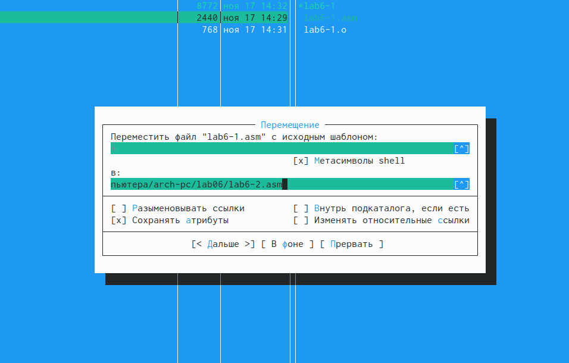{ #fig:011 width=70% }

12. Исправила текст программы в файле lab6-2.asm с использованием подпрограмм из внешнего файла in_out.asm в соответствии с листингом 6.2. Создала исполняемый файл и проверила его работу.(рис. [-@fig:012])

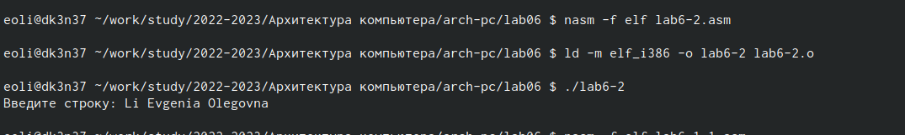{ #fig:012 width=70% }

13. В файле lab6-2.asm заменила подпрограмму sprintLF на sprint. Создала исполняемый файл и проверила его работу. (рис. [-@fig:013]

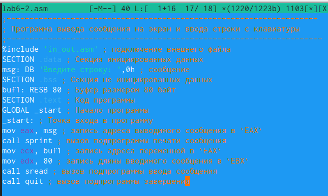{ #fig:013 width=70% }

Разница заключается в разном выводе результата. В подпрограмме sprint в одну строку, а в sprintLF результат выводится в 2 строки.

6.4. Задание для самостоятельной работы

1. Создала копию файла lab6-1.asm. Внесла изменения в программу (без использования внешнего файла in_out.asm), так чтобы она работала по требуемому алгоритму (рис. [-@fig:014]

{ #fig:014 width=70% }

2. Получила исполняемый файл и проверила его работу. На приглашение ввела свою фамилию.(рис. [-@fig:015]

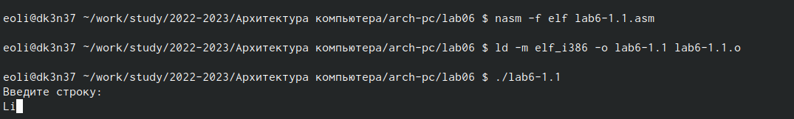{ #fig:015 width=70% }

3. Создала копию файла lab6-2.asm. Исправила текст программы с использованием подпрограмм из внешнего файла in_out.asm, так чтобы она работала по требуемому алгоритму(рис. [-@fig:016]

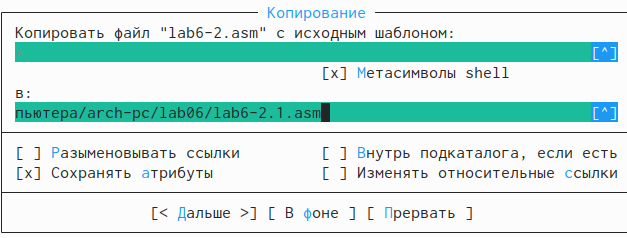{ #fig:016 width=70% }

4. Создала исполняемый файл и проверила его работу (рис. [-@fig:017]

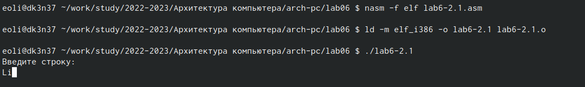{ #fig:017 width=70% }

# Выводы

Я приобрела практические навыки работы в Midnight Commander. Освоила инструкции языка ассемблера mov и int.

# Список литературы{.unnumbered}

::: {#refs}
:::
