---
## Front matter
title: "Лабораторная работа №7"
subtitle: "Архитектура компьютера"
author: "Ли Евгения Олеговна"

## Generic otions
lang: ru-RU
toc-title: "Содержание"

## Bibliography
bibliography: bib/cite.bib
csl: pandoc/csl/gost-r-7-0-5-2008-numeric.csl

## Pdf output format
toc: true # Table of contents
toc-depth: 2
lof: true # List of figures
lot: true # List of tables
fontsize: 12pt
linestretch: 1.5
papersize: a4
documentclass: scrreprt
## I18n polyglossia
polyglossia-lang:
  name: russian
  options:
	- spelling=modern
	- babelshorthands=true
polyglossia-otherlangs:
  name: english
## I18n babel
babel-lang: russian
babel-otherlangs: english
## Fonts
mainfont: PT Serif
romanfont: PT Serif
sansfont: PT Sans
monofont: PT Mono
mainfontoptions: Ligatures=TeX
romanfontoptions: Ligatures=TeX
sansfontoptions: Ligatures=TeX,Scale=MatchLowercase
monofontoptions: Scale=MatchLowercase,Scale=0.9
## Biblatex
biblatex: true
biblio-style: "gost-numeric"
biblatexoptions:
  - parentracker=true
  - backend=biber
  - hyperref=auto
  - language=auto
  - autolang=other*
  - citestyle=gost-numeric
## Pandoc-crossref LaTeX customization
figureTitle: "Рис."
tableTitle: "Таблица"
listingTitle: "Листинг"
lofTitle: "Список иллюстраций"
lotTitle: "Список таблиц"
lolTitle: "Листинги"
## Misc options
indent: true
header-includes:
  - \usepackage{indentfirst}
  - \usepackage{float} # keep figures where there are in the text
  - \floatplacement{figure}{H} # keep figures where there are in the text
---

# Цель работы

Освоение арифметических инструкций языка ассемблера NASM

# Задание

Освоиьть арифметические инструкции языка ассемблера NASM

# Теоретическое введение

Регистровая адресация – операнды хранятся в регистрах и в команде используются имена этих регистров, например: mov ax,bx.

Непосредственная адресация – значение операнда задается непосредственно в команде, Например: mov ax,2

# Выполнение лабораторной работы

1. Создала каталог для программам лабораторной работы No 7, перешла в него и создала файл lab7-1.asm:(рис. [-@fig:001])

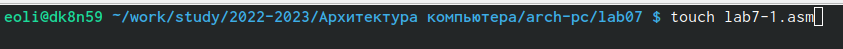{ #fig:001 width=70% }

2. Ввела в файл lab7-1.asm текст программы из листинга 7.1

Создала исполняемый файл и запустила его.(рис. [-@fig:002])

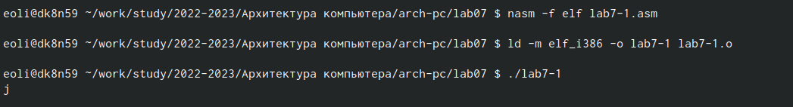{ #fig:002 width=70% } 

3. Далее изменила текст программы и вместо символов, записала в регистры числа. (рис. [-@fig:003])

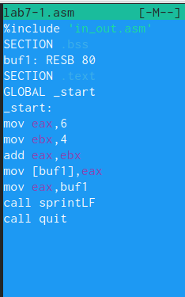{ #fig:003 width=70% }

Создала исполняемый файл и запустила его.(рис. [-@fig:004])

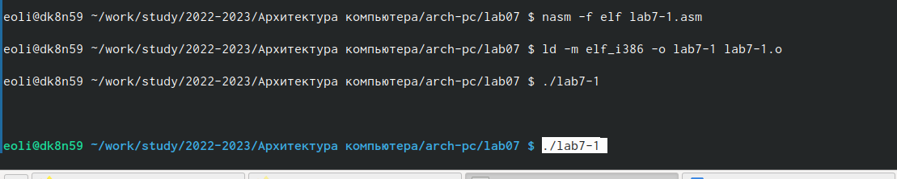{ #fig:004 width=70% }

Символ при выводе на экран не отображается

4. Создала файл lab7-2.asm и ввела в него текст программы из листинга 7.2.(рис. [-@fig:005; -@fig:006])

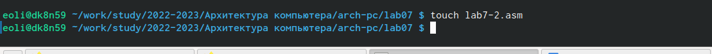{ #fig:005 width=70% }

Создала исполняемый файл и запустила его

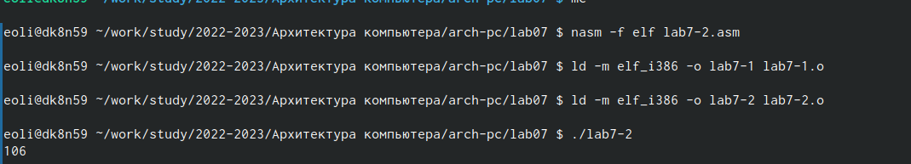{ #fig:006 width=70% }

5. Изменила символы на числа. (рис. [-@fig:007; -@fig:008; -@fig:009; -@fig:010])

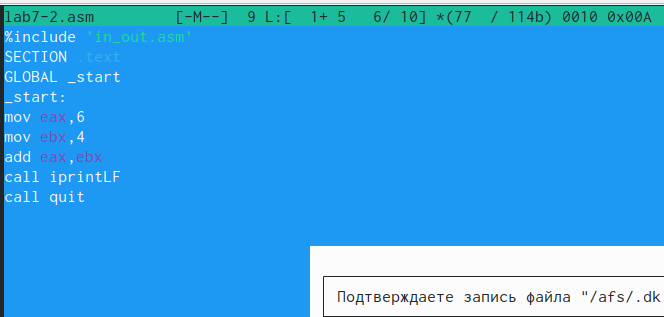{ #fig:007 width=70% }

Создала исполняемый файл и запустила его. 

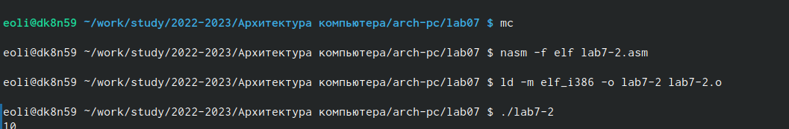{ #fig:008 width=70% }

Заменила функцию iprintLF на iprint.

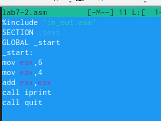{ #fig:009 width=70% }

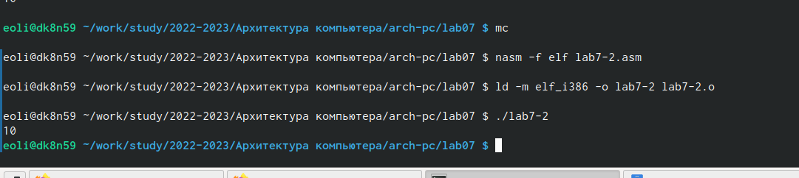{ #fig:010 width=70% }

7.3.2. Выполнение арифметических операций в NASM

6. Создала файл lab7-3.asm. Ввела текст программы из листинга 7.3  в lab7-3.asm.(рис. [-@fig:011])

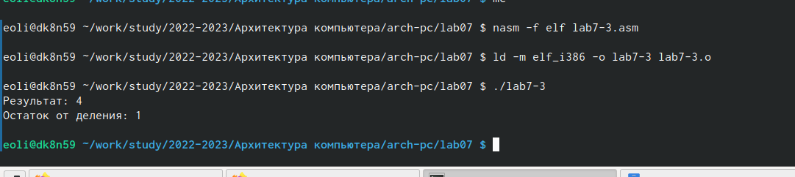{ #fig:011 width=70% }

Изменила текст программы для вычисления выражения y=(4*6+2)/5 (рис. [-@fig:012; -@fig:013])

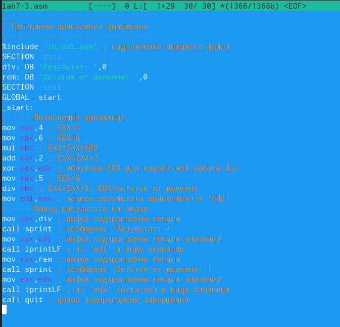{ #fig:012 width=70% }

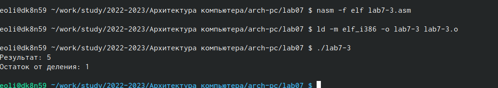{ #fig:013 width=70% }

7. Создала файл variant.asm. Ввела текст программы из листинга 7.4 в файл variant.asm.(рис. [-@fig:014])

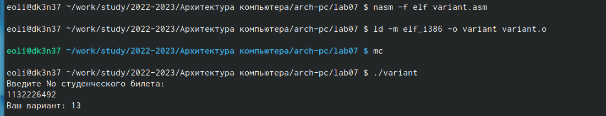{ #fig:014 width=70% }

1. Какие строки листинга 7.4 отвечают за вывод на экран сообщения ‘Ваш вариант:’? 

mov eax, msg call sprintLF

2. Для чего используется следующие инструкции? nasm mov ecx, xmov edx, 80 call sread

Для ввода переменной X с клавиатуры и сохранения введенных данных

3. Для чего используется инструкция “call atoi”?

Для преобраззования кода переменной ASCII в число

4. Какие строки листинга 7.4 отвечают за вычисления варианта?

mov ebx, 20 div ebx, inc edx

5. В какой регистр записывается остаток от деления при выполнении инструкции “div ebx”?

ebx

6. Для чего используется инструкция “inc edx”?

 Для увеличения значения edx на 1
 
7. Какие строки листинга 7.4 отвечают за вывод на экран результата вычислений?

mov eax, edx call iprint LF

7.4. Задание для самостоятельной работы

1. Написала программу вычисления выражения y=(8x+6)10. рис. [-@fig:015; -@fig:016])

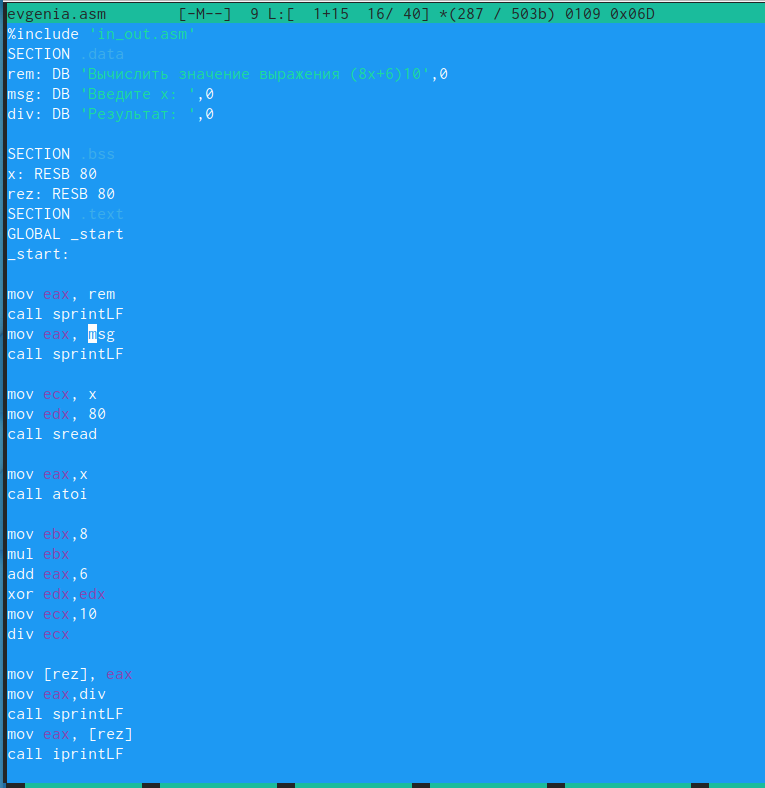{ #fig:015 width=70% }

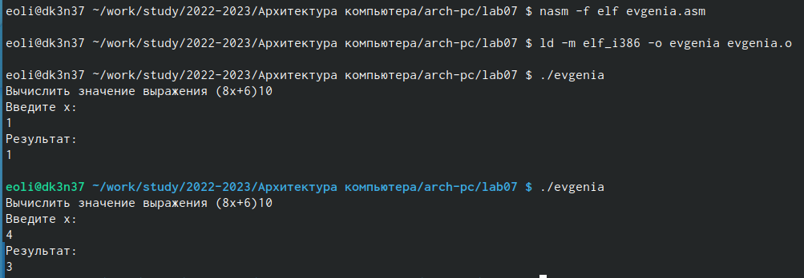{ #fig:016 width=70% }

# Выводы

Я освоила арифметические инструкции языка ассемблера NASM

# Список литературы{.unnumbered}

::: {#refs}
:::
