---
## Front matter
title: "Отчет по лабораторной работе №3"
subtitle: "Дисциплина: Архитектура компьютера"
author: "Ли Евгения Олеговна"

## Generic otions
lang: ru-RU
toc-title: "Содержание"

## Bibliography
bibliography: bib/cite.bib
csl: pandoc/csl/gost-r-7-0-5-2008-numeric.csl

## Pdf output format
toc: true # Table of contents
toc-depth: 2
lof: true # List of figures
lot: true # List of tables
fontsize: 12pt
linestretch: 1.5
papersize: a4
documentclass: scrreprt
## I18n polyglossia
polyglossia-lang:
  name: russian
  options:
	- spelling=modern
	- babelshorthands=true
polyglossia-otherlangs:
  name: english
## I18n babel
babel-lang: russian
babel-otherlangs: english
## Fonts
mainfont: PT Serif
romanfont: PT Serif
sansfont: PT Sans
monofont: PT Mono
mainfontoptions: Ligatures=TeX
romanfontoptions: Ligatures=TeX
sansfontoptions: Ligatures=TeX,Scale=MatchLowercase
monofontoptions: Scale=MatchLowercase,Scale=0.9
## Biblatex
biblatex: true
biblio-style: "gost-numeric"
biblatexoptions:
  - parentracker=true
  - backend=biber
  - hyperref=auto
  - language=auto
  - autolang=other*
  - citestyle=gost-numeric
## Pandoc-crossref LaTeX customization
figureTitle: "Рис."
tableTitle: "Таблица"
listingTitle: "Листинг"
lofTitle: "Список иллюстраций"
lotTitle: "Список таблиц"
lolTitle: "Листинги"
## Misc options
indent: true
header-includes:
  - \usepackage{indentfirst}
  - \usepackage{float} # keep figures where there are in the text
  - \floatplacement{figure}{H} # keep figures where there are in the text
---

# Цель работы

Изучение команд условного и безусловного переходов. Приобретение навыков написания программ с использованием переходов. Знакомство с назначением и структурой файла листинга.

# Задание

Изучить команды условного и безусловного переходов. Приобрести навыки написания программ с использованием переходов. Ознакомиться с назначением и структурой файла листинга.

# Теоретическое введение

условный переход – выполнение или не выполнение перехода в определенную точку программы в зависимости от проверки условия.

безусловный переход – выполнение передачи управления в определенную точку программы без каких-либо условий.

# Выполнение лабораторной работы

8.3.1. Реализация переходов в NASM

1. Я создала каталог для программам лабораторной работы No 8, перешла в него и создала файл lab8-1.asm:(рис. [-@fig:001])

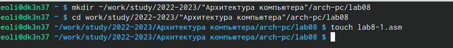{ #fig:001 width=70% }

2. Ввела в файл lab8-1.asm текст программы из листинга 8.1. Создала исполняемый файл и запустила его (рис. [-@fig:002])

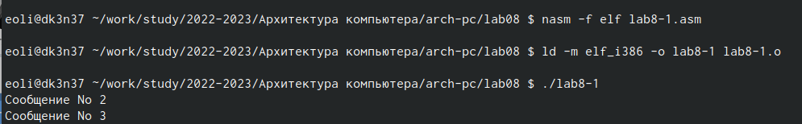{ #fig:002 width=70% }

Изменила текст программы в соответствии с листингом 8.2. Создала исполняемый файл и запустила его.(рис. [-@fig:003])

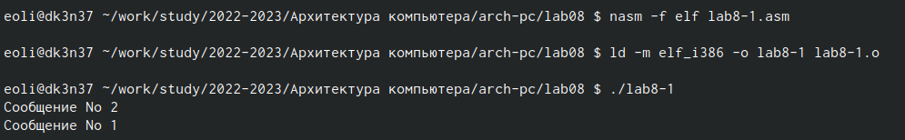{ #fig:003 width=70% }

Изменила текст программы, чтобы вывод программы был следующим:(рис. [-@fig:004])

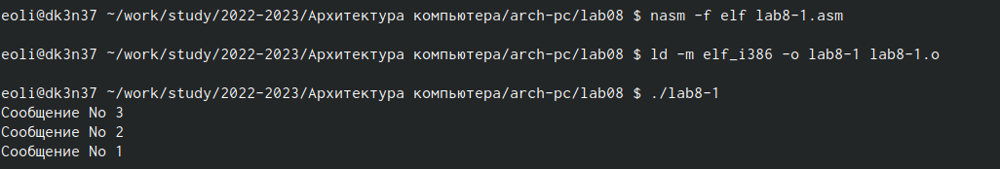{ #fig:004 width=70% }

Изменения: (рис. [-@fig:005])

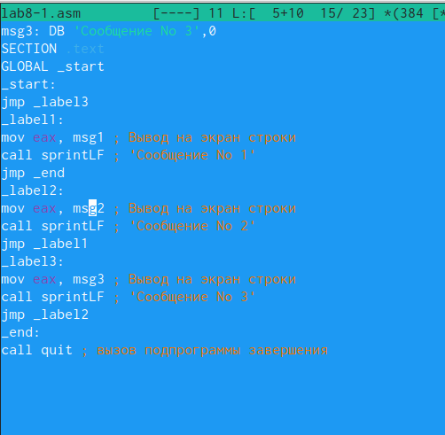{ #fig:005 width=70% }

3. Создала файл lab8-2.asm. и ввела в него текст программы из листинга 8.3.(рис. [-@fig:006])

{ #fig:006 width=70% }

Создала исполняемый файл и проверила его работу для разных значений B.(рис. [-@fig:007])

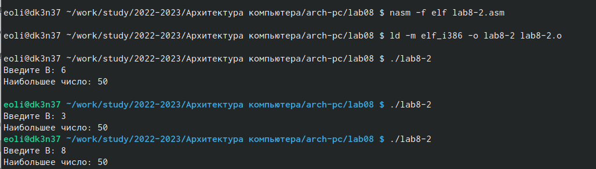{ #fig:007 width=70% }

8.3.2. Изучение структуры файлы листинга

4. Создала файл листинга для программы из файла lab8-2.asm (рис. [-@fig:008])

{ #fig:008 width=70% }

Открыла файл листинга lab8-2.lst с помощью текстового редактора mcedit: (рис. [-@fig:009])

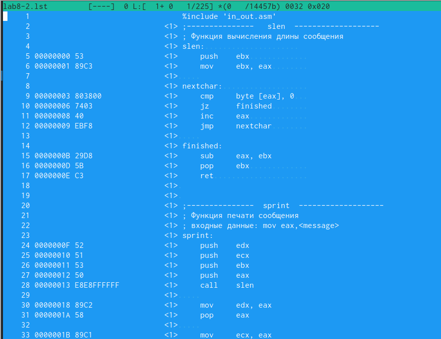{ #fig:009 width=70% }

Подробно объяснить содержимое трёх строк файла листинга по выбору(рис. [-@fig:010])

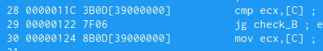{ #fig:010 width=70% }

28. сравниваем АиС, 29. переход на метку Б если А>C, 30. иначе ecx=C

В инструкции с двумя операндами файла с программой lab8-2.asm удалила один операнд. (рис. [-@fig:011])

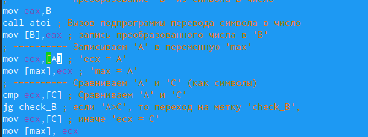{ #fig:011 width=70% }

Выполнила трансляцию с получением файла листинга:(рис. [-@fig:012])

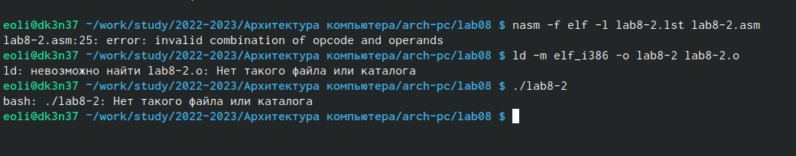{ #fig:012 width=70% }

В этом случае не получается выходных файлов

Листинг выдает ошибку, которая отражается в терминале (рис. [-@fig:013])

{ #fig:013 width=70% }

8.4. Задание для самостоятельной работы

1. Написала программу нахождения наименьшей из 3 целочисленных переменных a,b,c. Значения переменных выбрала из табл. 8.5 в соответствии с 13 вариантом (рис. [-@fig:014], [-@fig:015])

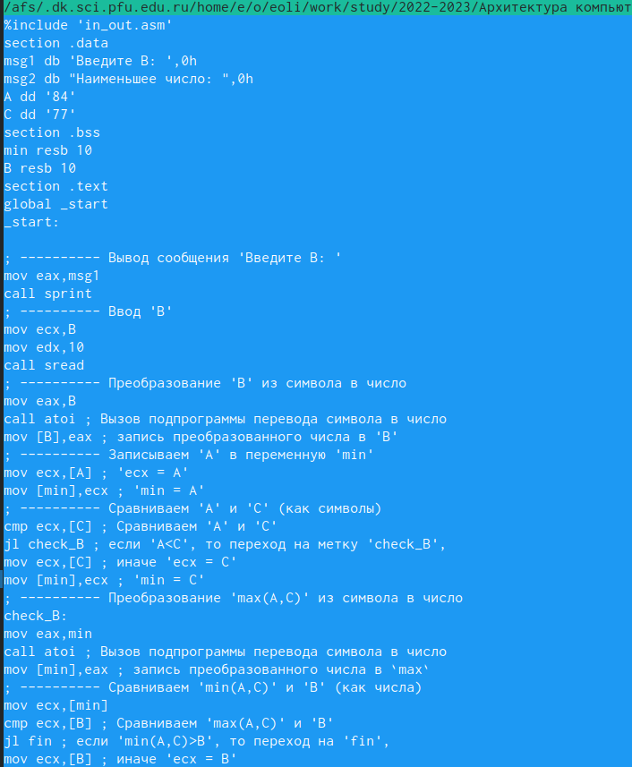{ #fig:014 width=70% }

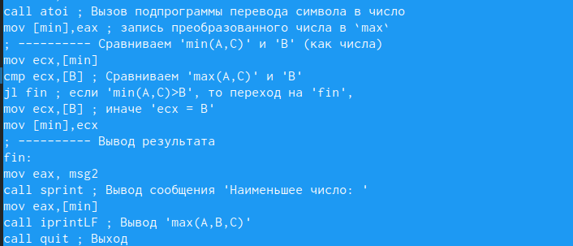{ #fig:015 width=70% }

Создала исполняемый файл и проверила его работу.(рис. [-@fig:016])

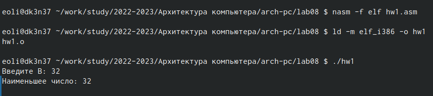{ #fig:016 width=70% }

2. Написала программу, которая для введенных с клавиатуры значений х и а вычисляет значение заданной функции и выводит результат вычислений.
 
Создала исполняемый файл и проверила его работу для значений (3;9);(6;4)

# Выводы

Изучила команды условного и безусловного переходов. Приобрела навыки написания программ с использованием переходов. Ознакомилась с назначением и структурой файла листинга.

# Список литературы{.unnumbered}

::: {#refs}
:::
